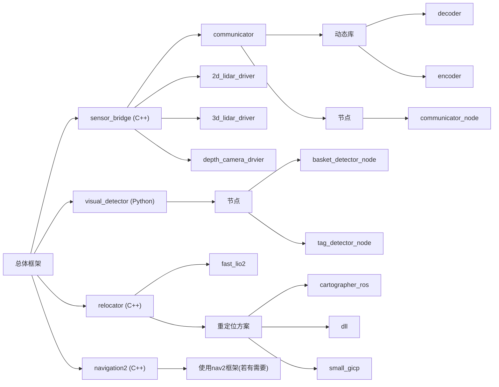

# RC_2025

2025 RC 上位机仓库

## 总体框架：

1. `sensor_bridge`（C++）

   - `communicator`：与下位机通信，进行解码编码工作
     - 动态库
       - `decoder`：解码信息
       - `encoder`：编码信息
     - 节点
       - `communicator_node`：通信、接收控制信息、发布下位机信息
   - `2d_lidar_driver`： ls 雷达驱动
   - `3d_lidar_driver`：livox 雷达驱动
   - `depth_camera_drvier`：D435i 相机驱动
2. `visual_detector`（Python）

   - 节点

     - `basket_detector_node`：接收相机信息，识别篮筐、发布控制信息、篮筐位置信息
     - `tag_detector_node`：接收相机信息，识别红绿贴纸，发布控制信息
3. `relocator`（C++）

   - `fast_lio2`：接收3d点云、imu信息，发布里程计信息
   - 重定位方案（方案0：在下位机使用 DT35激光+舵轮 解决）
     1. `cartographer_ros`：接收2d点云信息，进行重定位，发布定位信息
     2. `dll`：接收3d点云信息，进行重定位，发布定位信息
     3. `small_gicp`：接收3d点云信息，进行重定位，发布定位信息
4. `navigation2`（C++）

   - 如果需要，使用 `nav2` 框架进行到贴纸的规划及控制

